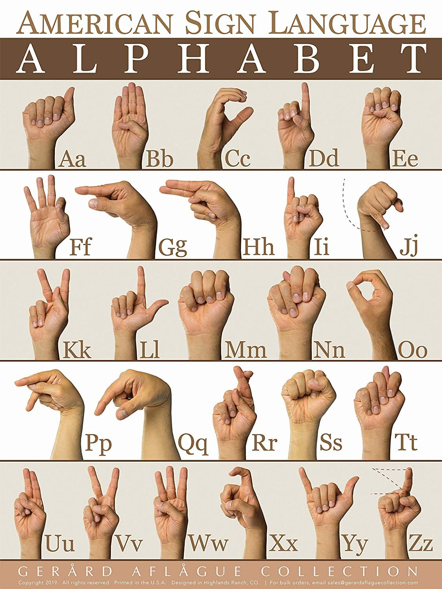

# Sign Language Letter Classifier

Real-time American Sign Language (ASL) recognition using MediaPipe hand landmarks and a TensorFlow neural network. The model detects and classifies 24 static ASL letters (A–Y, excluding J and Z, which require motion) directly from a webcam feed.

---

## How It Works

1. **Landmark extraction** — MediaPipe Hands detects 21 3D hand keypoints per frame.
2. **Normalization** — Landmarks are converted to palm-relative coordinates and scaled to \[−1, 1\], making predictions invariant to hand position and size.
3. **Classification** — A small fully-connected neural network maps the 63-dimensional landmark vector (21 joints × x/y/z) to one of 24 letter classes.
4. **Live overlay** — The predicted letter and confidence score are rendered on the webcam frame in real time.




---

## Project Structure

```
sign-language/
├── data_prep.py     # Webcam tool for collecting and logging landmark data to CSV
├── model.py         # Model definition and training script
├── testing.py       # Real-time inference using the trained model
├── letters.csv      # Self-collected landmark dataset (~12,700 samples, 24 classes)
├── model.keras      # Pre-trained Keras model (~87% validation accuracy)
├── alphabet.jpg     # ASL fingerspelling reference chart
├── landmarks.png    # MediaPipe hand landmark diagram
└── LICENSE          # MIT License
```

---

## Dataset

The dataset (`letters.csv`) was collected from scratch using `data_prep.py`. Each row contains a class label (0 = A, 1 = B, …, 23 = Y, skipping J and Z) followed by 63 normalized landmark values. The dataset contains approximately 12,700 samples across 24 classes.

---

## Setup

### Prerequisites

- Python 3.8+
- A webcam

### Install Dependencies

```bash
pip install mediapipe opencv-python tensorflow scikit-learn numpy keras
```

---

## Usage

### Collect Training Data

Run `data_prep.py` to open your webcam and log landmark samples to `letters.csv`. Uncomment the `logging_csv` call at the bottom of the loop and set the label integer (0 = A, 1 = B, …, 23 = Y) before running.

```bash
python data_prep.py
```

Press `q` to quit.

### Train the Model

```bash
python model.py
```

The script trains for 160 epochs on a 75/25 train/test split and saves the model to disk. Typical validation accuracy is ~87%. Update the save path at the bottom of `model.py` to match your environment.

### Run Inference

```bash
python testing.py
```

Opens your webcam and overlays the predicted letter and confidence score on each frame. Update the model load path at the top of `testing.py` to point to your saved `model.keras` file.

---

## Model Architecture

| Layer | Units | Activation | Dropout |
|---|---|---|---|
| Input | 63 | — | 0.2 |
| Dense | 80 | ReLU | 0.4 |
| Dense | 50 | ReLU | 0.2 |
| Dense | 30 | ReLU | — |
| Output | 24 | Softmax | — |

Optimizer: Adam · Loss: Sparse Categorical Crossentropy

---

## Notes

- The default webcam index in both scripts is `1`. Change `cv2.VideoCapture(1)` to `cv2.VideoCapture(0)` if your camera isn't detected.
- J and Z are excluded because they require hand motion rather than a static pose.
- The pre-trained `model.keras` is included so you can run inference without retraining.

---

## License

MIT © 2025 Joseph Davis
